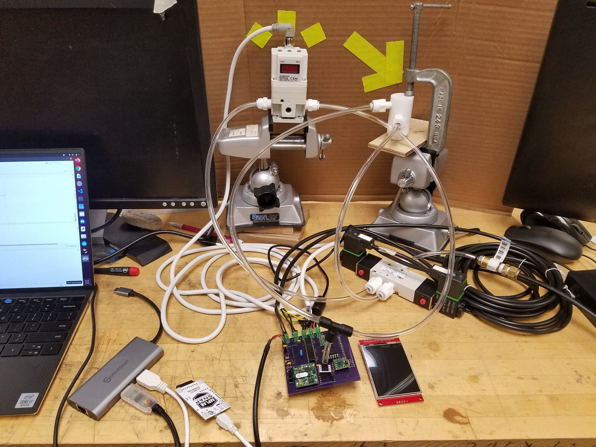

 

Portable, Automatable, MRI-Compatible Tactile Stimulation Device

<small>
    A device to aid the Robotics and Sensorimotor Control Lab’s efforts in improving our understanding of human somatosensory perception in their upper limbs
</small>
 

<small> </small>

    This research project contributed to the Robotics and Sensorimotor Control Lab’s efforts in improving our understanding of human somatosensory perception in their upper limbs. The overall project goal is to identify the reason for tactile perception deficits in individuals with stroke. My contribution to this project was to advance a proof-of-concept mechatronic device to one that could be used for pilot testing. My contributions to this project include developing the hardware and software to permit automated control of the mechanical stimuli applied to an individual’s fingertip. The system now includes, in addition to the actuator fabricated in the previous quarter, a pressure regulator, pressure sensor, PIC32-powered controller, and serial communication via a computer for automated control of and data collection from the device

<small>Project completed as MSR Final Project '21</small>

<small> </small>

<h2>Quickstart:</h2>

<b>Components</b>

    <i>Electronics:</i> 
    • <a href="https://www.amazon.com/Regulator-Adjustment-Regulating-Pneumatic-Proportional/dp/B081PMDPYD/ref=sr_1_5?dchild=1&keywords=electrical%2Bair%2Bpressure%2Bregulator&qid=1632938068&sr=8-5&th=1#descriptionAndDetails" target="_blank" style="margin: auto;">NNT digital pressure regulator</a> 
    • <a href="https://www.automationdirect.com/adc/shopping/catalog/pneumatic_components/basic_directional_control_solenoid_valves/5-port_(4-way),_3-pos.,_body_ported_-z-_manifold/avs-523c1-24d" target="_blank" style="margin: auto;">NITRA solenoid valve: 24 VDC, 3.0W</a> 
    • <a href="https://www.automationdirect.com/adc/shopping/catalog/cables/pneumatic_solenoid_valve_cables_-a-_connectors_(square_din_style)/11mm_(din_style)/sc11-ls24-3" target="_blank" style="margin: auto;">Murrelektronik solenoid valve cable (x2)</a> 
    • Power adaptor: 24V, 4.8W 
    • <a href="https://www.digikey.com/en/products/detail/microchip-technology/pic32mx170f256b-50i-sp/4902612" target="_blank" style="margin: auto;">PIC32MX170F256B-50I/SP</a> 
    • <a href="https://www.digikey.com/en/products/detail/microchip-technology/mcp4922-e-p/716251" target="_blank" style="margin: auto;">MCP4922-E/P</a> 
    • <a href="https://www.pololu.com/product/4038" target="_blank" style="margin: auto;">DRV8256E Single Brushed DC Motor Driver Carrier (x2)</a> 
    • <a href="https://www.mouser.com/ProductDetail/ABB/SHHD003A0A41Z?qs=dfay7wIA1uECvvxz2KyR3w%3D%3D" target="_blank" style="margin: auto;">DC DC CONVERTER 5V 15W</a> 
    • <a href="https://www.amazon.com/DEVMO-ILI9341-Display-240X320-Module/dp/B07WR3J2TV/ref=pd_rhf_dp_s_ci_mcx_mr_hp_d_20/137-6257348-8086039?pd_rd_w=8ewVg&pf_rd_p=0a853d15-c5a9-4695-90cd-fdc0b630b803&pf_rd_r=HKXT6TZ3QP5JV5VHQ6C8&pd_rd_r=12112545-ded2-4395-bef3-a9b053a04f96&pd_rd_wg=GEOo2&pd_rd_i=B07WR3J2TV&psc=1" target="_blank" style="margin: auto;">ILI9341 2.8" SPI TFT LCD Display 240X320 Module</a> 
    • <a href="https://www.digikey.com/en/products/detail/CSTLS8M00G53-B0/490-1212-ND/584420?itemSeq=359206536" target="_blank" style="margin: auto;">CSTLS8M00G53-B0</a> 
    • <a href="https://www.digikey.com/en/products/detail/stmicroelectronics/L4931CZ33-AP/1884870" target="_blank" style="margin: auto;">L4931CZ33-AP</a> 
    • <a href="https://www.adafruit.com/product/805" target="_blank" style="margin: auto;">Breadboard-friendly SPDT Slide Switch</a> 
    • 1 uF capacitor (x3) 
    • 0.1 uF capacitor (x2) 
    • 10 uF capacitor 
    • 3.3 kΩ resistor 
    • <a href="https://www.digikey.com/en/products/detail/vishay-dale/CMF551K7000BHR6/3618412?s=N4IgjCBcoEwAwA4CsVQGMoDMCGAbAzgKYA0IA9lANrgB0A7AAQDWA8gBYC2%2BIAuqQA4AXKCACqAOwCWglpgCyhbPgCuAJ0IgAvqQC0MVCAyRBq5SXJUQKHpu0h9kamHpMGZTg3X5J%2BQWVW8pABsBpIAJiI6YHAQAsKQICCkggCe-BoJShi2QA" target="_blank" style="margin: auto;">1.7 kΩ resistor</a> 
    • 330 Ω resistor 
    • 4.7 uF capacitor 
    • <a href="https://www.digikey.com/en/products/detail/PG164100/PG164100-ND/9562532?itemSeq=359206540" target="_blank" style="margin: auto;">MPLAB® SNAP</a> 
    • <a href="https://www.digikey.com/en/products/detail/adafruit-industries-llc/70/9092299" target="_blank" style="margin: auto;">FTDI Serial TTL-232 USB Cable</a> 
    • <a href="https://www.digikey.com/en/products/detail/3025010-03/Q853-ND/4341883?itemSeq=359206541" target="_blank" style="margin: auto;">Micro USB cable</a> 
    • <a href="https://www.digikey.com/en/products/detail/te-connectivity-amp-connectors/282834-2/1150135" target="_blank" style="margin: auto;">2 Position wire to board terminal block (x5)</a> 
    • Male header pins (x14) 
    • Female header pins (x22) 
    • Jumper wires 
    • <a href="https://www.digikey.com/en/products/detail/honeywell-sensing-and-productivity-solutions/SSCDANN150PGAA5/2416090" target="_blank" style="margin: auto;">Honeywell pressure sensor</a> 
    • <a href="https://oshpark.com/uploads/NTNtA6Eg" target="_blank" style="margin: auto;">Finpro PCB!</a> 
    &emsp;&emsp; • note: the gerber files are included in as CAMOutputs.zip. Please be sure to install Eagle for any adjustments of the .sch and .brd files.
     
    <i>Hardware:</i> 
    • <a href="https://www.mcmaster.com/8546K17/" target="_blank" style="margin: auto;">1-1/4" Diameter Chemical-Resistant Slippery PTFE Rod (1')</a> 
    • <a href="https://www.mcmaster.com/9262K974/" target="_blank" style="margin: auto;">2.62 mm Wide, 17.86 mm ID Oil-Resistant Buna-N O-Ring (pack of 25)</a> 
    • California Air Tools Light & Quiet 1P1060S Portable Air Compressor 
    • <a href="https://www.mcmaster.com/5648K74-5648K611/" target="_blank" style="margin: auto;">Firm polyurethane tubing for air and water, 1/8" ID, 1/4" OD</a> 
    • <a href="https://www.mscdirect.com/product/details/78058690?fromRR=Y" target="_blank" style="margin: auto;">Polypropylene Push-to-Connect Tube Male Connector, 1/4" Outside Diam, 1/8 NPTF</a> 
    • ¼” FNPT - ¼” Tru-Flate design T-style Plug 
    • SharkBite ¼” OD x ¼” MIP Male Adapter 
    • <a href="https://www.mcmaster.com/5779K14/" target="_blank" style="margin: auto;">Push-to-Connect Tube Fitting for AirStraight Connector, for 1/4" Tube OD (x10 or as needed)</a> 
    • <a href="https://www.mcmaster.com/5779K34/" target="_blank" style="margin: auto;">Push-to-Connect Tube Fitting for AirTee Connector, for 1/4" Tube OD</a> 
    • 1/8" Acrylic 
    • Acrylic adhesive 

<small>Note: unlinked items were either carried over from the previous project or purchased from Lemoi Ace Hardware</small>

 

<b>Assembly</b>

    Two roughly 2" long pieces of PTFE rod are first cut on the band saw to be cleaned and machined on the mill and lathe, one for the barrel, and another to be split into the piston and end cap. The dimensions of the above mentioned items are as follows:

     
    
    

    These items should then be assembled in the following fashion:

     

    The acrylic sheet is then cut into pieces to assemble the controller box.

     
     
     
     
     

    All pieces except for the back are adhered together with an acrylic adhesive. It is suggested to temporarily hold the pieces together with tape while they dry. The back piece is simply held on with a piece of tape to allow continued access to the screw terminals and the designated SNAP headers.

 

    The mount portion of the hand interface is 3D printed due to its complex geometry. It is derived from the pad_slice SolidWorks part included in the ref folder. It is attached to a laser cut rail using plastic screws, washers, and nuts.

<code>

    • PTFE Plastic ScrewExtreme-Temperature, Slotted

    • Flat Head, 6-32 Thread, 1" Long

    • Nylon Hex Nut6-32 Thread Size

    • Nylon Plastic Washerfor M4 Screw Size, 4.3 mm ID, 9 mm OD, Off-White

    • Nylon 6/6 Plastic Hex Standoff1/4" Hex, 2" Long, 6-32 Female Thread

</code>

    These components were orderd from McMaster Carr, but were not included in the bill of materials as a revised version of the interface will be used instead.

 

<b>Assembly</b>

    The tubing for the pneumatic system is connected as follows:

     

<small>Note: while the screen normally connects to the back of the pcb and all pcb components fit into the controller box, they are shown separately in this image for ease of understanding </small>

 

    These connections can also be interpreted from the following image:

     

    Finally, the pressure regulator, power supply, and solenoid valve are connected to the screw terminals as follows:

     

 

<b>Programming</b>

    Before any programming, please install <a href="https://www.microchip.com/en-us/development-tools-tools-and-software/mplab-x-ide" target="_blank" style="margin: auto;">MPLAB® X IDE</a> to easily modify code, make, and program the device (PIC32).

    After cloning the source code from the github repository, program the PIC32 using the <code>main_main.c</code> file.

    For quick testing, you can change the following variables in <code>main_main.c</code> to achieve the corresponding effects:

| variable        | value | effect                                         |
|-----------------|-------|------------------------------------------------|
| LATBbits.LATB12 | 0     | switch solenoid 0 on, solenoid 1 off           |
| LATBbits.LATB12 | 1     | switch solenoid 1 on, solenoid 0 off           |
| OC4RS           | 1600  | regulator duty cycle to low (low pressure output) |
| OC4RS           | 2000  | regulator duty cycle to med (med pressure output) |
| OC4RS           | 3000  | regulator duty cycle to low (low pressure output) |

    You can also write a fully automated time-based procedure by changing the above values over time in the <code>main_main.c</code> while loop.

 

    To log the pressure data in real time, all you have to do is run <code>Experiment-Monitor-Py/remyspeak.py</code> while the controller is powered. It will log the data into <code>Experiment-Monitor-Py/logpsi.csv</code>.

 
 

    And there you have it! Congratulations on your new portable, automatable, MRI-compatible tactile stimulation device!

